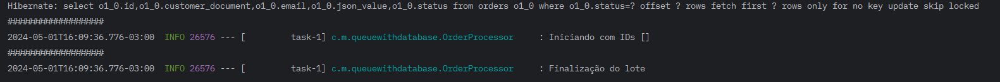

# Implementando um sistema de filas com o banco de dados postgres

## Introdução
Após ver algumas palestras do @Rafael Ponte, resolvi implementar um sistema de filas com o banco de dados postgres. A ideia é criar um sistema de filas que possa ser utilizado em um cenário com o banco de dados postgres, sem a necessidade de instalar um software de mensageria mais robusto como o RabbitMQ.
A ideia proposta é utilizar uma tabela alvo para armazenar as mensagens que serão processadas no futuro. No ato de processar as mensagens, o sistema utilizará locks para garantir que a mensagem seja processada apenas uma vez.

## O cenário de uso
A priori (v1), desenvolvi uma primeira versão do sistema apenas fazendo o passo a passo (fake) para finalizar uma compra.

- O processo consiste em:
- Receber as informações da compra
- Salvar a order no banco de dados
- Realizar o pagamento junto a um gateway qualquer
- Enviar um email da situação para o cliente
- Atualizar o estoque em um sistema externo
- Atualizar o pedido com o status "Paid"
- Retornar a resposta para o cliente


Para acompanhar no banco, use a query:
```sql
select 
(select count(1) from orders where status = 'Paid') as concluidos,
(select count(1) from orders where status = 'Pending') as pendentes,
(select count(1) from orders) as total
;
```

rodando um teste via postman com 100 virtual users, tivemos o seguinte resultado:

com uma média de responsetime de aproximadamente 16seg e uma taxa de 4.79 requisições por segundo.
veja que não tivemos erros, mas o tempo de resposta foi muito alto.

## A solução

Habilitando o job nas envs e rodando o projeto novamente, veremos o seguinte log ao iniciar a aplicação:

veja que a cada x segundos (definido no application.properties) o job é executado e as mensagens são processadas.
Logamos os IDS sendo utilizados no momento a fim de garantir que a mensagem seja processada apenas uma vez e possamos paralelizar o job.

O ponto chave aqui é o final da query que busca os peridos a serem processados:
```sql
where o1_0.status=? offset ? rows fetch first ? rows only for no key update skip locked
```
selecionamos os pedidos pendentes que não estão em uso (locks) e processamos. O for no key update nos dá o lock na linha, garantindo que a mesma não seja processada por outra thread e o skip locked nos dá a garantia de que não pegaremos a mesma linha em outra thread.

Realizando o mesmo teste com 100 virtual users, tivemos o seguinte resultado:


Destaco aqui a média de responsetime de 2,4 segundos e uma taxa de 27 requisições por segundo. Atendemos mais requests em menos tempo.
Como você deve imaginar, a mudança aqui foi não fazer todas as chamadas custosas de forma sequencial no método que processa o pedido, mas sim salvar o estado atual do pedido/mensagem (escolhemos o formato json)
e processar em um momento futuro.

Agora as mensagens estão sendo processadas em blocos e os pedidos estão sendo devidamente finalizados. Caso a velocidade de finalização não esteja tão rápida quanto o esperado, podemos aumentar o número de threads que processam as mensagens, ou até mesmo o número de mensagens processadas por bloco. No exemplo abaixo, aumentei o número de consumidores para 5, esse número é determinado pelo seu contexto.


Dicas e insigths que vi ao longo do desenvolvimento: 
- logar o tempo de processamento de cada bloco, para que você possa ter uma ideia de quanto tempo está demorando para processar as mensagens e assim ajustar o número de consumidores.
- organizar o consumidor de forma que ele seja capaz de processar as mensagens em paralelo, para que você possa ter um ganho de performance.
- subir o consumidor em um container separado, para que você possa escalar de forma independente.

## Referências
- https://www.youtube.com/watch?v=jTLP5DrIocA
- https://blog.postman.com/postman-api-performance-testing/